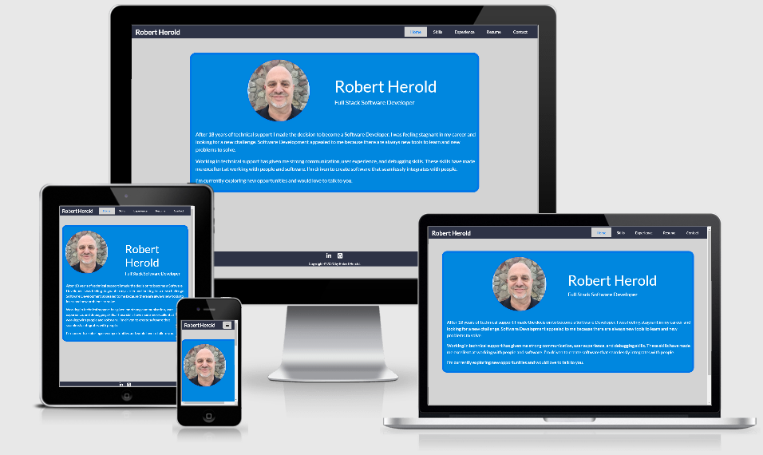

# Robert Herold Portfolio

This site will be an ongoing dynamic page, designed to furnish information on my coding skills and career journey.

Initial creation is for my first milestone project as a Full Stack software developer student of the Code Institute (https://codeinstitute.net/), 
with the goal of presenting information to potential employers/recruiters who will be able to assess my qualifications quickly and efficiently.

## UX

 The purpose of the site is to provide a simple, easy to use format presenting information about myself.

 #### User Stories

   * As a recruiter, I want to quickly and easily find all relevant information on the potential client.

   * As an employer, my need to find past working experience is important to me.

   * On our Human Resources team, we look for the information that pertains to the specific needs of the company, and does this individual have those skill sets.

 ## Features

### Existing Features

  * __Home page__ - A picture and brief introduction to myself. Clicking on my name at top left on any page on the site will always bring you back to Home page.

  * __Skills__ -Allows the user to see my current coding skill set. When a user clicks on any one of the logos on this page, it is hyperlinked to a wikipedia info page about that skill.

  * __Experience__  -My career journey presented in a timeline fashion. Clicking on any of the corporate entities listed here, will immediately open up a seperate page linked to their corporate web site.

  * __Resume__  -The latest edition of my resume.  This resume needs to be updated at the time of this writing to reflect my current/ongoing coding skill set and education.

  * __Contact__  -An e-mail form to send a request for contact to me.  This form responds to input and sends an e-mail directly to my e-mail inbox at Yahoo.

  ###  Features Left to Implement

  * __Projects__ - A page to showcase completed coding projects created by myself.  

  
 ## Technologies Used

 1. **HTML, or Hyper Text Markup Language:**  Used to construct all the pages of this web site.  For further info on this language;   
 https://developer.mozilla.org/en-US/docs/Web/HTML

 2. **CSS, or Cascading Style Sheets:**  Is used to style various elements on a web page via coloring, fonts, spacing, etc.  For further info, see this link;
 https://www.w3.org/Style/CSS/Overview.en.html

 3. **Bootstrap:**  A CSS framework that assists the programmer in creating responsive, mobile first front-end web sites.  https://getbootstrap.com/

 4. **Visual Studio Code:**  Is a programming code editor created by Microsoft that I used extensively.  It allows programmers to create, save and edit their code on their own pc's.
 https://code.visualstudio.com/

 5. **SourceTree:**  A software application that runs on your computer that simplifies saving your programming code from your PC up to an oline respository like Github.  You do not have to use a command line interface when using this application.  For further info; 
  https://www.sourcetreeapp.com/

 6. **Gitpod:**  An online IDE also used for creating & saving code that runs in a browser, it does not have to be installed on your PC.
 https://www.gitpod.io/

 7. **Git:**  A version control system for tracking changes in source code during software development.  https://git-scm.com/

 8. **GitHub:** A company that provides hosting for software development version control using Git. It is a subsidiary of Microsoft. https://github.
 
 9. **Chrome DevTools:**   A set of web developer tools built directly into the Google Chrome browser.  I used these tools constantly thoughout the development cycle.    https://developers.google.com/web/tools/chrome-devtools

 ## Testing

 1.  http://ami.responsivedesign.is/  has been used to see how the site performs on different Apple devices and their viewports, all pages, links, icons performed as expected on all devices. I also used it to create the AppleDevicesView.png at the top of this Readme.

 2.  **Desktop**
     
       * Google Chrome, Internet Edge & Mozilla Firefox browsers; all pages, links on those pages, and footer icon links perform well on all viewport sizes. Developer tools were also used on all browsers for the various viewport sizes.

 3.  **Mobile**

      *  Used my iPhone6 plus, as well as relative's iPhone X, Android smartphones to test;  all pages, links, icons performed well on all devices using various browsers; Safari & Chrome.      

4.   **Contact Form**

     1.  Go to Contact page

     2.  Try to submit the form without a correct syntax e-mail address and you will get an error message requesting a proper e-mail address be entered.

     3. Trying to submit the form with any empty fields will also give you a "Please fill out this field" message.

     4.  When you do hit the Submit button, the default e-mail program for your PC will open right up, or on smartphones it asks you which e-mail program you want to use to send the e-mail.  It will populate your e-mail for you, and will automatedly send me the e-mail, as my address populates also.  I have received many e-mails successfully testing this process.

 4.  **Open Issues:**  The most obvious issues I have seen in testing are shown below circled in red. On Viewports starting at 765 x 850, on the Experience page, the Timeline seems to have a 2nd connecting white line connecting the companie's content elements, as well as a slightly different colored arrow (not all) pointing to the main timeline, and the circular dot on the timeline is lightly cut off on the left side of the circle.
  Due to time constraints on getting this project submitted I'm unable to address them right now.

 

 

         
## Deployment

  1. Created a Github account at https://github.com
  My account url;    https://github.com/BobHerold

  2. I uploaded all files to my Github repository located at this url;  https://github.com/BobHerold/RobertHeroldportfolio   which is for this individual project.

  3. To publish the project to see it on the web, I then went into the Settings on my respository, scrolled down to the heading, GitHub Pages. Under the Source setting, I used the drop-down menu to select master branch as a publishing source and saved it.  Refreshed the github page, and you are then given a url where your page is published;
   Your site is published at https://bobherold.github.io/RobertHeroldportfolio/

  4.  To run this code on your local machine, you would go to my respository at 
https://github.com/BobHerold/RobertHeroldportfolio   and on the home page on the right hand side just above all the files, you will see a green button that says,
"Clone or download", this button will give you options to clone with HTTPS, open in desktop or download as a zip file.
To continue with cloning, you would;
  * Open Git Bash
  * Change the current working directory to the location where you want the cloned directory to be made.
  * Type git clone, and then paste this URL; https://github.com/BobHerold/RobertHeroldportfolio.git      Press Enter. Your local clone will be created.

  For more information about the above process; https://help.github.com/en/github/creating-cloning-and-archiving-repositories/cloning-a-repository

## Credits

### Content

   1. HTML & CSS Timeline code directly from;  Bootstrap 4.1.1 Snippet by Siddharth Panchal;  https://bootsnipp.com/snippets/Q0ppE "Timeline Using CSS"  Timeline Demo #11.
      Used on my Experience page.

   2.  W3schools.com; for code used on e-mail form on Contact page.     https://www.w3schools.com/

   3.  Google Fonts for font styles;  https://fonts.google.com/

### Media

   1. Adobe Color for choosing a color palette for overall use on entire site; https://color.adobe.com/create#

   2. Colorspace for my final color palette;  https://mycolor.space/

   3. Used https://tinyjpg.com/   to compress .jpg images down to smaller size for better more efficient loading of web site.

   4. Am I Responsive web site for checking responsiveness on all Apple devices screen sizes;
   http://ami.responsivedesign.is/

   5. W3schools.com; for code used on e-mail form; constantly referred to this web site for examples, explanations, their Pixel to Em Converter, etc. https://www.w3schools.com/

   6. Font Awesome for hamburg icon; https://fontawesome.com/

### Acknowledgements

1. Code Institute Tutors; Anna for her many helpful posts and info on Slack for using Bootstrap, Milestone projects, etc.  Stephen and Haley also.  Richard Wells-lead on Slack's User-Centric Channel for his informative Slack calls on creating Milestone 1 projects.

2. Mentor Sandeep Aggarwal for site architecture inspiration and great advice.
https://www.linkedin.com/in/asandeepme/

3. My son Dakota Herold for his programming recommendations and advice.
https://www.linkedin.com/in/dakotaherold/

